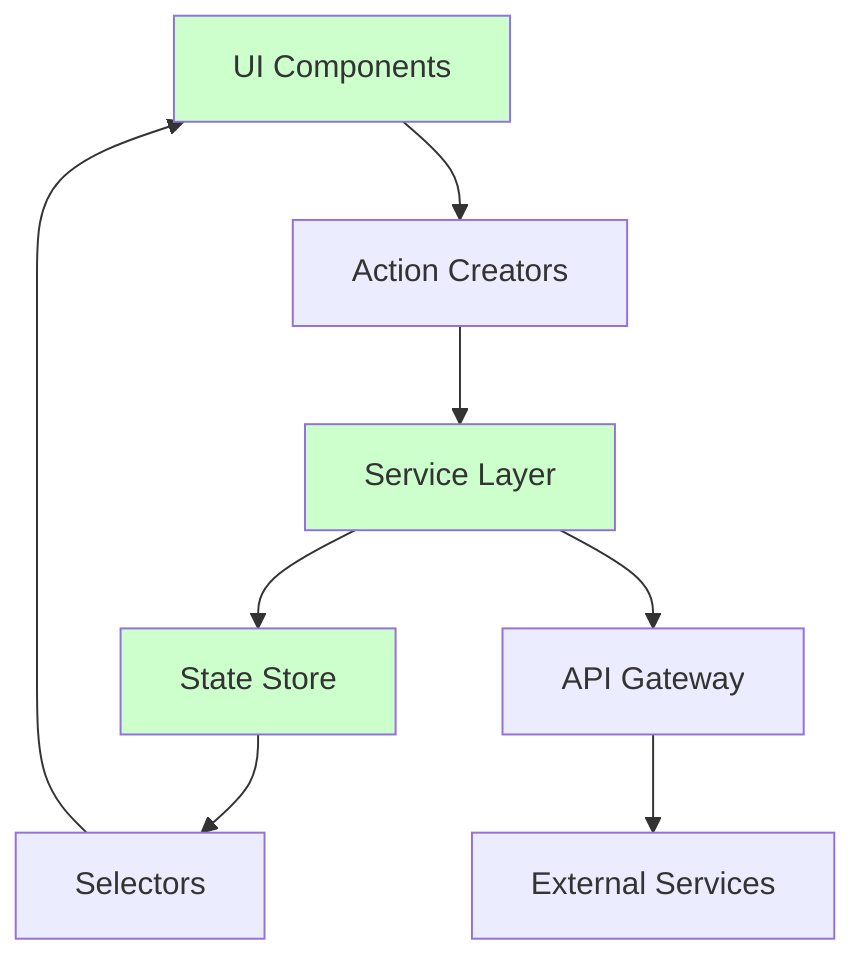

# Public Services Module - Architecture Review

## 🏛️ Executive Summary

This comprehensive architecture review evaluates the PublicServices module's design, structure, and implementation patterns. The module demonstrates functional capability but exhibits significant architectural debt that impacts scalability, maintainability, and performance.

**Overall Architecture Grade: C- (Requires Major Improvements)**

## 📋 Review Scope

- **Module**: PublicServices (@egovernments/digit-ui-module-public-services)
- **Version**: 0.0.1
- **Technology Stack**: React 17.0.2, React Router 5.3.0, React Query 3.6.1
- **Review Date**: 2025-09-03
- **Lines of Code**: ~3,500+ lines

## 🏗️ Current Architecture Overview

### High-Level Architecture

```
┌─────────────────────────────────────────────────────────────────┐
│                        DIGIT Platform                           │
│  ┌───────────────────────────────────────────────────────────┐  │
│  │               PublicServices Module                       │  │
│  │  ┌─────────────┐ ┌─────────────┐ ┌─────────────────────┐  │  │
│  │  │   Pages     │ │ Components  │ │      Configs        │  │  │
│  │  │             │ │             │ │                     │  │  │
│  │  │ Employee/   │ │ Workflow    │ │ Service             │  │  │
│  │  │ DigitDemo/  │ │ Actions     │ │ Configuration       │  │  │
│  │  │ CheckList/  │ │ Forms       │ │ UI Customizations   │  │  │
│  │  └─────────────┘ └─────────────┘ └─────────────────────┘  │  │
│  │  ┌─────────────┐ ┌─────────────┐                          │  │
│  │  │  Services   │ │   Utils     │                          │  │
│  │  │             │ │             │                          │  │
│  │  │ API         │ │ Transform   │                          │  │
│  │  │ Requests    │ │ Functions   │                          │  │
│  │  └─────────────┘ └─────────────┘                          │  │
│  └───────────────────────────────────────────────────────────┘  │
└─────────────────────────────────────────────────────────────────┘
```

### Architecture Style Assessment

| Aspect | Current State | Grade | Notes |
|--------|---------------|-------|-------|
| **Layered Architecture** | Partially Implemented | D+ | Layers exist but boundaries are blurred |
| **Separation of Concerns** | Poor | D | Mixed responsibilities across components |
| **Modularity** | Limited | C- | Some modular structure but tight coupling |
| **Scalability** | Poor | D | Hard-coded patterns limit scalability |
| **Testability** | Very Poor | F | Global dependencies make testing difficult |

## 🧩 Component Architecture Analysis

### 1. Component Hierarchy Issues

**Current Structure:**
```
PublicServicesModule (Root) ⚠️ API calls + UI logic
├── PublicServicesCard ✅ Simple presentation
├── EmployeeApp (Router) ✅ Pure routing
│   ├── DigitDemoComponent ❌ 270 lines, multiple concerns
│   │   ├── FormComposerV2 ✅ Reusable component
│   │   └── Stepper ✅ Reusable component
│   ├── DigitDemoViewComponent ❌ Complex state + API calls
│   ├── WorkflowActions ❌ 279 lines, mixed concerns
│   └── InboxService ⚠️ Some mixing of concerns
```

**Critical Issues:**

1. **Violation of Container/Presenter Pattern**
   ```javascript
   // DigitDemoComponent.js:12-40
   // Component handles:
   // - Form state management
   // - API calls to MDMS
   // - localStorage operations  
   // - Navigation logic
   // - UI rendering
   ```

2. **Prop Drilling Anti-Pattern**
   ```javascript
   // Data flows through 3+ component levels unnecessarily
   PublicServicesModule → EmployeeApp → DigitDemoComponent → FormComposer
   ```

3. **Tight Component Coupling**
   ```javascript
   // src/components/WorkflowActions.js:102-107
   const workflowDetails = useWorkflowDetails({
     tenantId, id: applicationNo, moduleCode: businessService
   });
   // Direct service calls in UI components
   ```

### 2. Recommended Component Architecture

```
┌─────────────────────────────────────────────────────────────┐
│                    Feature-Based Architecture                │
├─────────────────────────────────────────────────────────────┤
│ Providers/                                                  │
│ ├── ServiceConfigProvider.jsx                             │
│ ├── WorkflowProvider.jsx                                  │
│ └── AuthProvider.jsx                                      │
├─────────────────────────────────────────────────────────────┤
│ Features/                                                   │
│ ├── ApplicationForm/                                       │
│ │   ├── containers/ (Smart Components)                     │
│ │   ├── components/ (Dumb Components)                      │
│ │   ├── hooks/                                            │
│ │   └── services/                                         │
│ ├── ApplicationView/                                       │
│ └── Workflow/                                             │
├─────────────────────────────────────────────────────────────┤
│ Shared/                                                     │
│ ├── components/                                            │
│ ├── hooks/                                                │
│ ├── services/                                             │
│ └── utils/                                                │
└─────────────────────────────────────────────────────────────┘
```

## 🔄 Data Flow Architecture Review

### Current Data Flow Problems

```mermaid
graph TD
    A[Module.js] -->|Direct API| B[/service endpoint]
    B --> C[localStorage]
    C --> D[DigitDemoComponent]
    D -->|Direct API| E[MDMS]
    D -->|Direct API| F[Workflow Service]
    E --> G[generateFormConfig]
    G --> H[FormComposerV2]
    H --> I[User Input]
    I --> J[transformToApplicationPayload]
    J -->|Direct API| K[Application Service]
    
    style A fill:#ffcccc
    style D fill:#ffcccc
    style C fill:#ffffcc
    style J fill:#ffcccc
```

**Issues Identified:**

1. **No Central Data Store**: Data scattered across localStorage, component state, and API responses
2. **Bidirectional Data Flow**: Components both consume and mutate data directly
3. **No Data Validation Layer**: Raw API responses used directly in UI
4. **State Synchronization**: localStorage and component state can diverge

### Recommended Data Flow Architecture



**Benefits:**
- Unidirectional data flow
- Centralized state management
- Clear data transformation points
- Testable data layer

## 🌐 Service Layer Architecture

### Current Service Implementation Issues

**File**: `src/components/Request.js` (212 lines)

**Problems:**
1. **Monolithic Service**: Single function handles authentication, caching, privacy, error handling
2. **Global Side Effects**: Direct manipulation of `window` objects
3. **Mixed Concerns**: HTTP client + business logic + error handling

```javascript
// Current implementation issues:
export const Request = async ({
  method = "POST", url, data = {}, headers = {},
  useCache = false, params = {}, auth=true, 
  // ... 15+ parameters, violating function complexity
}) => {
  // 170+ lines of mixed responsibilities
}
```

### Recommended Service Architecture

```javascript
// Proposed layered service architecture:

// 1. HTTP Client Layer
class HttpClient {
  async request(config) {
    // Pure HTTP operations
  }
}

// 2. Authentication Service  
class AuthService {
  getToken() { /* secure token retrieval */ }
  refreshToken() { /* token refresh logic */ }
}

// 3. Business Services
class ApplicationService {
  constructor(httpClient, authService) {
    this.http = httpClient;
    this.auth = authService;
  }
  
  async createApplication(payload) {
    // Business logic for application creation
  }
}

// 4. Service Registry
const serviceRegistry = {
  http: new HttpClient(),
  auth: new AuthService(),
  application: new ApplicationService()
};
```

## 🗄️ State Management Review

### Current State Management Issues

**Multiple State Storage Mechanisms:**

1. **Component State** (useState/useReducer)
   ```javascript
   // DigitDemoComponent.js:26-29
   const [currentStep, setCurrentStep] = useState(savedStep);
   const [formData, setFormData] = useState(savedFormData);
   const [sessionData, setSessionData] = useState(savedFormData);
   const [showToast, setShowToast] = useState(null);
   ```

2. **Browser Storage** (localStorage/sessionStorage)
   ```javascript
   // Scattered across multiple files:
   localStorage.setItem("formData", JSON.stringify(formData));
   sessionStorage.setItem("formData", JSON.stringify(formData));
   ```

3. **Global State** (window.Digit.RequestCache)
   ```javascript
   // Request.js:51
   window.Digit.RequestCache[key] = returnData;
   ```

**Critical Problems:**
- **State Fragmentation**: No single source of truth
- **Race Conditions**: Async state updates can conflict
- **Memory Leaks**: No cleanup strategies
- **Data Inconsistency**: Multiple storage mechanisms can diverge

### Recommended State Architecture

```javascript
// Centralized state management with React Context + useReducer:

const AppState = {
  ui: {
    currentStep: 1,
    isLoading: false,
    errors: {}
  },
  forms: {
    applicationData: {},
    draftData: {},
    validationErrors: {}
  },
  services: {
    configurations: {},
    workflows: {},
    cache: {}
  }
};

const AppContext = createContext();

const stateReducer = (state, action) => {
  switch(action.type) {
    case 'FORM_DATA_UPDATE':
    case 'STEP_CHANGE':
    case 'API_REQUEST_START':
    case 'API_REQUEST_SUCCESS':
    case 'API_REQUEST_FAILURE':
    // etc.
  }
};
```

## 🔧 Configuration Architecture Assessment

### Current Configuration Issues

**File**: `src/configs/serviceConfiguration.js` (429 lines)

**Problems:**
1. **Monolithic Configuration**: All service definitions in single object
2. **No Schema Validation**: Configuration structure not validated
3. **Mixed Deployment**: Some config from MDMS, some hardcoded
4. **Poor Maintainability**: Changes require code deployment

```javascript
// Current problematic approach:
export const serviceConfig = {
  "ServiceConfiguration": [
    { // 400+ lines of trade license configuration }
  ]
}
```

### Recommended Configuration Architecture

```javascript
// 1. Configuration Schema
const ServiceConfigSchema = {
  type: "object",
  properties: {
    module: { type: "string" },
    service: { type: "string" },
    fields: { type: "array", items: { $ref: "#/field" } }
  }
};

// 2. Runtime Configuration Loader
class ConfigurationService {
  async loadServiceConfig(module, service) {
    const config = await this.mdmsService.fetch(module, service);
    return this.validator.validate(config, ServiceConfigSchema);
  }
}

// 3. Configuration Provider
const ConfigProvider = ({ children }) => {
  const [configs, setConfigs] = useState({});
  
  return (
    <ConfigContext.Provider value={{ configs, loadConfig }}>
      {children}
    </ConfigContext.Provider>
  );
};
```

## 🚧 Architectural Anti-Patterns Identified

### 1. God Object Anti-Pattern

**File**: `src/utils/index.js`
- **Size**: 800+ lines
- **Responsibilities**: 8+ different concerns
- **Impact**: Difficult testing, high coupling, poor maintainability

### 2. Global State Pollution

```javascript
// Throughout codebase:
window.Digit = window.Digit || {};
window.Digit[Library] = window.Digit[Library] || {};
window.Digit[Library][service] = method;
```
- **Impact**: Global namespace pollution, testing difficulties, tight coupling

### 3. Anemic Domain Model

```javascript
// All business logic in utility functions, no domain objects:
export const transformToApplicationPayload = (formData, configMap, service, tenantId, config, workflowDetails, applicationNumber, serviceCode, action) => {
  // 85 lines of transformation logic
}
```
- **Impact**: No encapsulation, scattered business rules

### 4. Shotgun Surgery Anti-Pattern

- **Issue**: Changes to form behavior require modifications across multiple files
- **Files Affected**: Utils, components, configs, and pages
- **Impact**: High maintenance cost, error-prone changes

### 5. Feature Envy

```javascript
// Components accessing external object properties extensively:
const tenantId = Digit.ULBService.getCurrentTenantId();
const user = Digit.UserService.getUser();
const store = Digit.Services.useStore({stateCode, moduleCode, language});
```

## 🎯 Recommended Target Architecture

### 1. Clean Architecture with Feature Modules

```
src/
├── features/                      # Feature-based organization
│   ├── application-form/
│   │   ├── components/
│   │   ├── containers/
│   │   ├── hooks/
│   │   ├── services/
│   │   └── index.js
│   ├── application-view/
│   ├── workflow-management/
│   └── shared/
├── core/                         # Core infrastructure
│   ├── services/
│   │   ├── api/
│   │   ├── auth/
│   │   └── config/
│   ├── state/
│   │   ├── providers/
│   │   ├── reducers/
│   │   └── selectors/
│   └── utils/
├── infrastructure/               # External integrations
│   ├── digit-platform/
│   ├── mdms/
│   └── workflow/
└── shared/                      # Shared utilities
    ├── components/
    ├── hooks/
    └── types/
```

### 2. Dependency Injection Architecture

```javascript
// Service container for dependency injection:
class ServiceContainer {
  constructor() {
    this.services = new Map();
  }
  
  register(name, factory) {
    this.services.set(name, factory);
  }
  
  get(name) {
    return this.services.get(name)();
  }
}

// Usage in components:
const ApplicationForm = () => {
  const applicationService = useService('applicationService');
  const configService = useService('configService');
  // Component logic
};
```

### 3. Event-Driven Architecture

```javascript
// Event system for loose coupling:
const EventBus = {
  emit(event, data) { /* publish event */ },
  on(event, handler) { /* subscribe to event */ },
  off(event, handler) { /* unsubscribe */ }
};

// Usage:
// Form component
EventBus.emit('form:submitted', applicationData);

// Workflow component  
EventBus.on('form:submitted', (data) => {
  workflowService.initiate(data);
});
```

## 🔍 Specific Architecture Problems

### 1. Monolithic Utils File

**Current**: `src/utils/index.js` (800+ lines)

**Functions Mixed:**
- `transformToApplicationPayload()` - Data transformation
- `generateViewConfigFromResponse()` - UI configuration  
- `useWorkflowDetails()` - API hook
- `downloadStudioPDF()` - File operations
- `getDetailsByIdWorks()` - Workflow logic

**Recommended Refactoring:**
```
src/
├── services/
│   ├── ApplicationService.js
│   ├── WorkflowService.js  
│   └── DocumentService.js
├── transformers/
│   ├── PayloadTransformer.js
│   └── ViewConfigTransformer.js
└── hooks/
    ├── useWorkflowDetails.js
    └── useApplicationDetails.js
```

### 2. Configuration Coupling

**Current**: Hardcoded configuration mixed with MDMS
```javascript
// serviceConfiguration.js - 429 lines of hardcoded config
// PLUS
// MDMS fetch for dynamic config
```

**Recommended**: Unified configuration strategy
```javascript
class ConfigurationStrategy {
  async getConfig(source, module, service) {
    switch(source) {
      case 'mdms': return await this.mdmsAdapter.fetch(module, service);
      case 'local': return await this.localAdapter.fetch(module, service);
      case 'remote': return await this.remoteAdapter.fetch(module, service);
    }
  }
}
```

### 3. API Integration Anti-Patterns

**Current Issues:**
- Direct axios calls in components
- No request/response interceptors
- Mixed authentication patterns
- No API versioning strategy

```javascript
// Current problematic pattern:
const response = await axios.get("/public-service/v1/service", {
  params: { tenantId },
  headers: {
    "X-Tenant-Id": tenantId,
    "auth-token": window?.localStorage?.getItem("Employee.token"),
  },
});
```

**Recommended API Architecture:**
```javascript
// API service with interceptors and error handling:
class ApiService {
  constructor(baseURL, authService) {
    this.client = axios.create({ baseURL });
    this.setupInterceptors();
  }
  
  setupInterceptors() {
    this.client.interceptors.request.use(this.requestInterceptor);
    this.client.interceptors.response.use(this.responseInterceptor, this.errorInterceptor);
  }
  
  async get(endpoint, options = {}) {
    return this.client.get(endpoint, options);
  }
}
```

## 📊 Architecture Quality Metrics

### Current Metrics
| Metric | Current Value | Target | Status |
|--------|---------------|---------|---------|
| **Cyclomatic Complexity** | 15+ (High) | <7 | ❌ |
| **Coupling** | High | Low | ❌ |
| **Cohesion** | Low | High | ❌ |
| **Component Size** | 270+ lines | <150 lines | ❌ |
| **File Size** | 800+ lines | <200 lines | ❌ |
| **Dependency Count** | 10+ per module | <5 | ❌ |

### Architecture Debt Assessment

```
Technical Debt Categories:
├── 🔴 Critical (Immediate Action Required)
│   ├── Monolithic utils file
│   ├── Global state pollution
│   └── Security vulnerabilities
├── 🟡 Significant (Address Soon)  
│   ├── Component coupling
│   ├── Configuration management
│   └── Error handling
└── 🟢 Minor (Future Improvements)
    ├── Performance optimizations
    ├── Code documentation
    └── Accessibility improvements
```

## 🛠️ Implementation Roadmap

### Phase 1: Foundation Refactoring (2-3 months)

**Week 1-2: Service Layer Extraction**
- Create dedicated service classes
- Implement dependency injection
- Add proper error handling

**Week 3-6: Component Restructuring**  
- Split monolithic components
- Implement container/presenter pattern
- Remove global state dependencies

**Week 7-12: State Management Implementation**
- Implement centralized state management
- Remove localStorage dependencies
- Add state persistence strategies

### Phase 2: Architecture Enhancement (3-4 months)

**Month 1: Configuration Management**
- Implement unified configuration strategy
- Add configuration validation
- Create configuration providers

**Month 2: API Architecture**
- Implement API service layer
- Add request/response interceptors
- Implement proper caching

**Month 3: Testing Infrastructure**
- Add comprehensive test suite
- Implement mocking strategies
- Add integration tests

### Phase 3: Advanced Features (2-3 months)

**Month 1: Performance Optimization**
- Implement code splitting
- Add memoization strategies
- Optimize bundle size

**Month 2: Scalability Enhancements**
- Add plugin system
- Implement micro-frontend capabilities
- Add advanced monitoring

## 📈 Success Criteria

### Technical Metrics
- **Code Coverage**: >80%
- **Performance**: <2s load time
- **Bundle Size**: <500KB gzipped
- **Error Rate**: <1%

### Architecture Quality
- **Coupling**: Low (measured via dependency graphs)
- **Cohesion**: High (measured via component responsibilities)
- **Maintainability**: High (measured via code complexity)
- **Testability**: High (measured via test coverage and mock ability)

## 🎯 Conclusion and Risk Assessment

### Current Architecture Risks

| Risk | Probability | Impact | Mitigation |
|------|-------------|--------|------------|
| **Maintenance Crisis** | High | High | Immediate refactoring |
| **Security Vulnerabilities** | Medium | High | Security audit + fixes |
| **Performance Degradation** | Medium | Medium | Performance optimization |
| **Scalability Issues** | High | Medium | Architecture redesign |

### Architecture Maturity Level

**Current**: Level 1 - Initial/Ad-hoc
- Inconsistent patterns
- Reactive maintenance
- High technical debt

**Target**: Level 4 - Managed/Optimized  
- Consistent architecture patterns
- Proactive maintenance
- Controlled technical debt

### Return on Investment

**Investment Required**: 8-12 months of development effort
**Expected Benefits**:
- 60% reduction in maintenance costs
- 40% improvement in development velocity  
- 80% reduction in production issues
- Enhanced team productivity and morale

## 📝 Action Items

### Immediate (Next Sprint)
1. Create service abstraction layer
2. Extract component business logic
3. Implement error boundaries
4. Add TypeScript definitions

### Short-term (Next Quarter)
1. Refactor component architecture
2. Implement state management solution
3. Add comprehensive testing
4. Create configuration management system

### Long-term (Next 6 months)
1. Migrate to clean architecture
2. Implement performance optimizations
3. Add advanced monitoring and logging
4. Create architectural documentation and guidelines

---

**Architecture Review Conducted By**: Development Team  
**Review Date**: 2025-09-03  
**Next Review**: 2025-12-03  
**Priority**: HIGH - Immediate architectural intervention required**